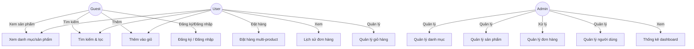
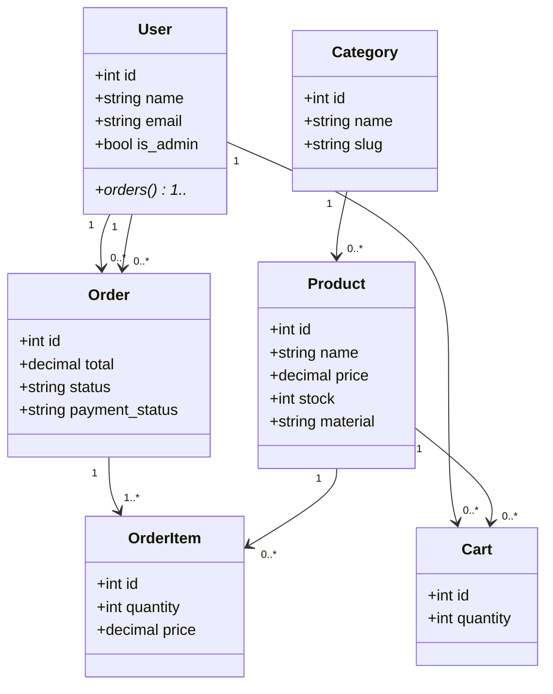
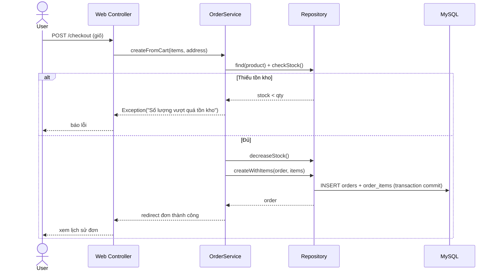

```mermaid
graph TD
  Guest((Guest))
  User((User))
  Admin((Admin))

  Guest -->|Xem sản phẩm| V1[Xem danh mục/sản phẩm]
  Guest -->|Tìm kiếm| V2[Tìm kiếm & lọc]
  Guest -->|Thêm| V3[Thêm vào giỏ]
  Guest -->|Đăng ký/Đăng nhập| A1[Đăng ký / Đăng nhập]

  User --> V1
  User --> V2
  User --> V3
  User -->|Đặt hàng| O1[Đặt hàng multi-product]
  User -->|Xem| O2[Lịch sử đơn hàng]
  User -->|Quản lý| C1[Quản lý giỏ hàng]

  Admin -->|Quản lý| M1[Quản lý danh mục]
  Admin -->|Quản lý| M2[Quản lý sản phẩm]
  Admin -->|Xử lý| M3[Quản lý đơn hàng]
  Admin -->|Quản lý| M4[Quản lý người dùng]
  Admin -->|Xem| M5[Thống kê dashboard]
```

```mermaid
classDiagram
  class User {
    +int id
    +string name
    +string email
    +bool is_admin
    +orders() 1..*
  }
  class Category {
    +int id
    +string name
    +string slug
  }
  class Product {
    +int id
    +string name
    +decimal price
    +int stock
    +string material
  }
  class Cart {
    +int id
    +int quantity
  }
  class Order {
    +int id
    +decimal total
    +string status
    +string payment_status
  }
  class OrderItem {
    +int id
    +int quantity
    +decimal price
  }
  User "1" --> "0..*" Order
  Category "1" --> "0..*" Product
  User "1" --> "0..*" Cart
  Product "1" --> "0..*" Cart
  User "1" --> "0..*" Order
  Order "1" --> "1..*" OrderItem
  Product "1" --> "0..*" OrderItem
```

```mermaid
sequenceDiagram
  actor User
  participant Ctrl as Web Controller
  participant Svc as OrderService
  participant Repo as Repository
  participant DB as MySQL

  User->>Ctrl: POST /checkout (giỏ)
  Ctrl->>Svc: createFromCart(items, address)
  Svc->>Repo: find(product) + checkStock()
  alt Thiếu tồn kho
    Repo-->>Svc: stock < qty
    Svc-->>Ctrl: Exception("Số lượng vượt quá tồn kho")
    Ctrl-->>User: báo lỗi
  else Đủ
    Svc->>Repo: decreaseStock()
    Svc->>Repo: createWithItems(order, items)
    Repo->>DB: INSERT orders + order_items (transaction commit)
    Repo-->>Svc: order
    Svc-->>Ctrl: redirect đơn thành công
    Ctrl-->>User: xem lịch sử đơn
  end
```

